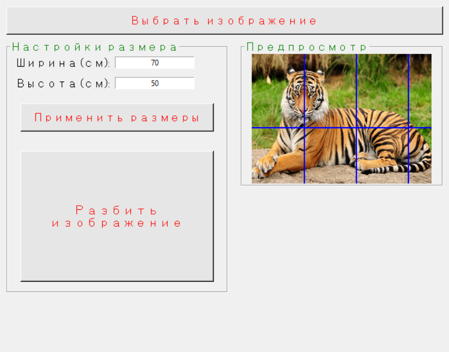

# Image Cutter
## About
This is a GUI app for splitting images into grid. Each element is an image made for printing on A4 paper. The grid is determined by the size of the canvas specified by user.
## Why?
I have a friend who likes to do painting and has a simple printer. So they asked for an app to split pictures into pieces to print them 
on A4 paper, then stitch them back togheter on a canvas and use it to learn to draw better. \
So the main point of the app is to split the image using the sizes of the painter canvas and A4 paper.
## Gallery

